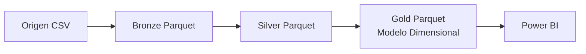
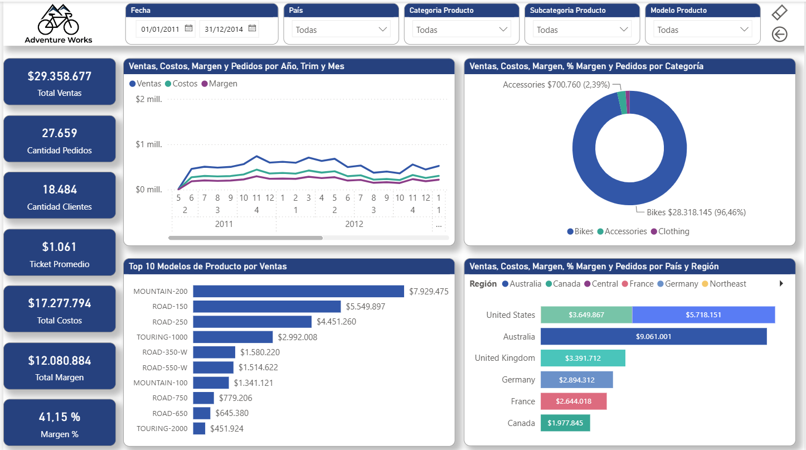
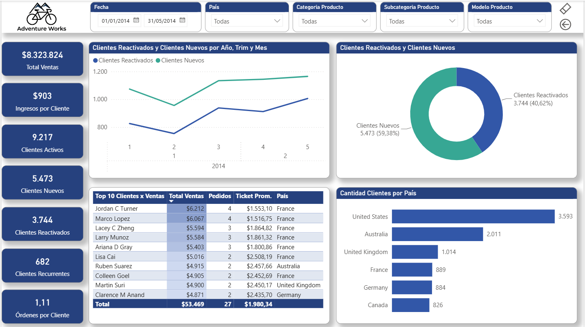
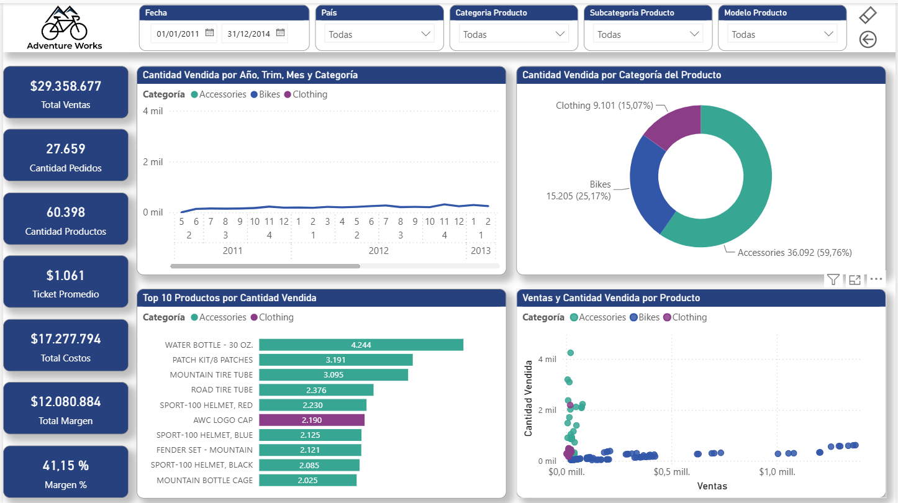

# AdventureWorks Medallion Analytics

Implementación de un datamart de **Internet Sales** end-to-end utilizando arquitectura Medallion, desde la ingesta de datos hasta la visualización en Power BI.

El objetivo del proyecto es construir un pipeline de datos aplicando conceptos de ingeniería de datos, arquitectura Medallion, procesamiento analítico con DuckDB, almacenamiento en formato Parquet y modelado dimensional basado en Kimball, tomando como caso de uso el dataset de ventas por internet de AdventureWorks.

---

## Tabla de contenidos

- [Arquitectura](#arquitectura)
- [Origen de datos](#origen-de-datos)
- [Capas](#capas)
  - [Bronze](#bronze)
  - [Silver](#silver)
  - [Gold](#gold)
- [Modelo dimensional](#modelo-dimensional)
- [Tecnologías utilizadas](#tecnologías-utilizadas)
- [Estructura del proyecto](#estructura-del-proyecto)
- [Decisiones de diseño](#decisiones-de-diseño)
- [Dashboard Power BI](#dashboard-power-bi)
- [Requisitos](#requisitos)
- [Ejecución](#ejecución)
- [Mejoras futuras](#mejoras-futuras)
- [Licencia](#licencia)

---

# Arquitectura

El proyecto implementa una arquitectura tipo Medallion:



---

# Origen de datos

Simula el sistema fuente: un conjunto de archivos CSV originales, tal como llegarían desde un sistema externo (ERP, base transaccional, exportación manual, etc.), almacenados en `data/raw/`.

Es el punto de partida que Bronze lee para iniciar la ingesta, sin transformaciones ni metadata adicional.

---

# Capas

El pipeline gestiona tres capas siguiendo el modelo Medallion:

## Bronze

Capa inicial de almacenamiento en formato Parquet.

Responsabilidad:

- Ingesta de datos con **DuckDB** (`read_csv_auto`).
- Conversión desde CSV a Parquet.
- Conservación de la información original.
- Incorporación de metadata técnica:

  - `_ingestion_ts`: timestamp de carga.
  - `_source_file`: archivo origen.

---

## Silver

Capa de datos refinados y preparados para consumo analítico.

Responsabilidad:

- Limpieza de datos.
- Conversión de tipos.
- Aplicación de reglas de transformación.
- Deduplicación de registros mediante `ROW_NUMBER()` particionado por clave de negocio, conservando la versión más reciente según `modified_date`.
- Preparación de entidades analíticas.
- Incorporación de metadata técnica:

  - `_ingestion_ts`: heredado de Bronze.
  - `_transform_ts`: timestamp de transformación.

Las transformaciones son ejecutadas utilizando DuckDB sobre archivos Parquet.

---

## Gold

Capa analítica construida siguiendo principios de modelado dimensional de Kimball.

Implementación de un modelo dimensional con **esquema copo de nieve (snowflake)**: la mayoría de las dimensiones se conectan directamente a la tabla de hechos, pero dos jerarquías están normalizadas en niveles:

- `fact_internet_sales` → `dim_product` → `dim_product_subcategory` → `dim_product_category`
- `dim_customer` → `dim_geography` → `dim_sales_territory`

Dimensiones y hechos se regeneran completos en cada ejecución del pipeline (full overwrite). No obstante, incorporan metadata técnica pensada para una futura estrategia incremental:

- `_hash`: hash de los atributos, preparado para detectar cambios si en el futuro se implementa una carga incremental.
- `_insert_ts`: timestamp de primera inserción del registro.
- `_update_ts`: timestamp de la última actualización del registro.

Estos campos no implementan lógica de merge actualmente; su propósito es dejar el modelo listo para migrar a una estrategia incremental (por ejemplo, sobre Delta Lake o Iceberg) sin tener que rediseñar el esquema.

### Dimensiones

El orden de ejecución de los scripts en `sql/gold/` está determinado por un prefijo numérico en el nombre del archivo, reflejando las dependencias del esquema copo de nieve: cada nivel solo puede ejecutarse después de que exista el nivel del que depende.

- `01_dim_currency`
- `01_dim_date`
- `01_dim_product_category`
- `01_dim_promotion`
- `01_dim_sales_territory`
- `02_dim_geography` *(depende de `01_dim_sales_territory`)*
- `02_dim_product_subcategory` *(depende de `01_dim_product_category`)*
- `03_dim_customer` *(depende de `02_dim_geography`)*
- `03_dim_product` *(depende de `02_dim_product_subcategory`)*
- `10_fact_internet_sales` *(se ejecuta al final, luego de todas las dimensiones)*

### Hechos

- fact_internet_sales

**Granularidad:** una fila por línea de detalle de orden (`order_detail`). La fact integra `order_header` y `order_detail`: los atributos y montos definidos a nivel de encabezado (por ejemplo, flete o impuestos) se prorratean hacia el detalle según su participación proporcional en el total de la orden, para respetar la granularidad declarada sin duplicar montos.

La capa Gold contiene los datos preparados para herramientas de Business Intelligence.

---

# Modelo dimensional

El modelo final sigue principios de Kimball:

- Declaración explícita de la granularidad del hecho.
- Dimensiones con claves sustitutas.
- Tabla de hechos con claves foráneas hacia dimensiones.
- Separación entre atributos descriptivos y métricas.
- Manejo de miembro desconocido (`-1`) en dimensiones.
- Preparación del modelo para análisis mediante herramientas BI.

---

# Tecnologías utilizadas

- **Python** — lenguaje base del pipeline.
- **DuckDB** — motor único para ingesta (Bronze), transformación (Silver) y modelado dimensional (Gold).
- **SQL** — lógica de transformación y modelado dimensional sobre Parquet.
- **Parquet** — formato de almacenamiento en todas las capas.
- **Power BI** — visualización final.

---

# Estructura del proyecto

```text
adventureworks-medallion-analytics/

├── pipeline.py

├── src/
│   ├── ingestion.py
│   ├── transformation.py
│   └── loading.py

├── sql/
│   ├── silver/
│   └── gold/

├── data/
│   ├── raw/
│   ├── bronze/
│   ├── silver/
│   └── gold/

├── logs/

├── bi/
│   ├── resumen-de-ventas.png
│   ├── clientes.png
│   └── productos.png

├── requirements.txt
├── .gitignore
├── LICENSE
└── README.md
```

El pipeline completo se ejecuta mediante `pipeline.py`, orquestando tres etapas secuenciales:

1. **Ingestion** — CSV → Bronze Parquet
2. **Transformation** — Bronze → Silver Parquet
3. **Loading** — Silver → Gold Parquet

El resultado final es consumido desde Power BI.

---

# Decisiones de diseño

- Se utilizó Parquet como formato de almacenamiento analítico debido a su eficiencia y compatibilidad con herramientas modernas de procesamiento de datos.

- Se utilizó DuckDB como motor único a lo largo de todo el pipeline (ingesta, transformación y modelado), lo que simplifica el stack y evita la sobrecarga de cargar archivos completos en memoria antes de escribirlos.

- La capa Gold fue diseñada siguiendo principios de Kimball para facilitar el consumo desde herramientas de Business Intelligence.

- Se optó por un esquema copo de nieve en las jerarquías de producto y geografía en lugar de aplanarlas a un esquema estrella puro, para evitar redundancia de atributos descriptivos en cada fila de la dimensión base (`dim_product`, `dim_customer`). La decisión simula un escenario donde esas jerarquías cambian con cierta frecuencia y el volumen de datos justifica normalizar, aun a costa de un join adicional al consultar desde Power BI; el dataset de este proyecto es pequeño y demostrativo, pero el objetivo es mostrar el criterio aplicado, no optimizar para este volumen puntual.

- Se implementó una estrategia de carga full overwrite en las capas Silver y Gold debido al volumen y naturaleza demostrativa del dataset.

- Los scripts SQL de Gold usan un prefijo numérico (`01_`, `02_`, `03_`, `10_`) para controlar el orden de ejecución según las dependencias del esquema copo de nieve. El orquestador itera los archivos con `sorted()` para garantizar que ese orden se respete independientemente del sistema operativo.

- La carpeta `data/` (~68 MB) se incluye en el repositorio para que cualquiera pueda clonarlo y ejecutar el pipeline completo sin depender de fuentes externas.

- El archivo `.pbix` no se incluye en el repositorio para proteger el diseño del reporte; en su lugar, el dashboard se comparte mediante el reporte publicado en la web y capturas de referencia en `bi/`.

- Una implementación productiva podría incorporar cargas incrementales mediante detección de cambios, particionamiento, CDC o formatos de almacenamiento con soporte transaccional como Delta Lake.

---

# Dashboard Power BI

La capa Gold es consumida por Power BI para generar un informe analítico enfocado en **Internet Sales**.

🔗 [Ver el reporte interactivo publicado](https://app.powerbi.com/view?r=eyJrIjoiODBkNzAwYjctNWQ1YS00YTNlLThmOWEtZjhiMDg3ZmQ2M2RlIiwidCI6ImYxZmQxOWQ2LTAxZGEtNDhkNS1hOGVjLTBmNTA5YmIwMDk5MiIsImMiOjR9)

**Resumen de Ventas**



**Clientes**



**Productos**



El dashboard incluye:

- Análisis general de ventas.
- Análisis de clientes.
- Análisis de productos.
- Métricas de ventas y rentabilidad.

El informe permite interactuar mediante filtros por:

- Período de tiempo.
- País.
- Categoría de producto.
- Subcategoría de producto.
- Modelo de producto.

El dashboard incluye medidas DAX para ventas, margen y rentabilidad, construidas sobre el modelo Gold.

---

# Requisitos

- Python 3.10 o superior
- pip

El proyecto tiene una única dependencia externa: **DuckDB**, especificada en `requirements.txt`.

---

# Ejecución

Instalar dependencias:

```bash
pip install -r requirements.txt
```

Ejecutar pipeline:

```bash
python pipeline.py
```

El pipeline generará las siguientes capas:

```text
data/

├── bronze/

├── silver/

└── gold/
```

---

# Mejoras futuras

- Incorporar datamarts adicionales (por ejemplo, compras o inventario).
- Implementar cargas incrementales.
- Automatizar ejecución mediante un scheduler.
- Agregar pruebas de calidad de datos.
- Implementar Slowly Changing Dimensions (SCD) tipo 2.
- Incorporar monitoreo del pipeline.

---

# Licencia

El código fuente de este proyecto está disponible bajo la licencia MIT.

El conjunto de datos Adventure Works pertenece a Microsoft y se utiliza únicamente con fines demostrativos.